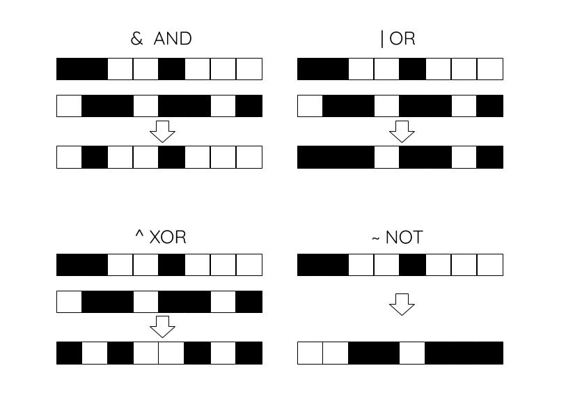

# CoderDojo2019 ZMS BitWise
Durante esta sesión vamos a desarrollar algunos ejercicios relacionados con las unidades más pequeñas de la compputación.

Vamos a bajar a nivel de bit y vamos a aprender cómo desarrollar con grupos de bits para obtener algunos resultados.

En estos ejercicios se valorarán las soluciones que se puedan integrar en pocas lineas de código. Cada uno de los ejercicios tiene una puntuación que puede variar en función de la dificultad. El objetivo es conseguir la máxima puntuación. 

Para desarrollar los siguientes ejercicios se pueden elegir entre estos dos lenguajes de programación.
- [Python](https://repl.it/languages/python3) 
- [C++](https://repl.it/languages/cpp) 

# BitWise Operators

Lo primero que tenemos que aprender es qué son los operadores a nivel de bit.

- &  --> El operador AND funciona como una puerta lógica AND. 
- |  --> El operador OR. 
- ^  --> Operador XOR.
- ~  --> Negacion de bit
- >> --> Desplazamiento a la derecha
- << --> Desplazamiento a la izquierda.

# Ejercicios propuestos

Dada una secuencia de unos y ceros almacenados en una dirección de memoria. Se pide:

- Encontrar la posición del primer bit con valor uno.
- Encontrar la posición del primer bit con valor cero
- Encontrar la longitud de 1s que se repiten a partir de la aparicion del primer bit.
- Desplazamiento circular. Cuando se desplaza un bit, se pierde información en uno de los extremos. El desplazamiento circular se basa en recuperar la información perdida en un extremo hacia el contrario.
- Erode - Si tenemos un conjunton de bits, eliminar los extremos en una unidad.
- Dilate - Dado un conjunto de bits agrupados, extender en una unidad por sus extremos.
- Dibujar un emoticono de 10 filas con unos y ceros con bits.
- Sacar la operación que habría que realizar para obtener el resultado de la siguiente imagen.

