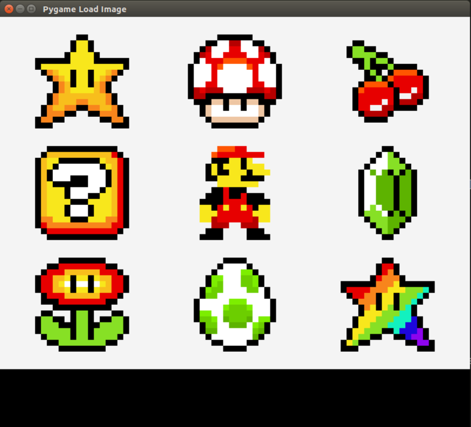
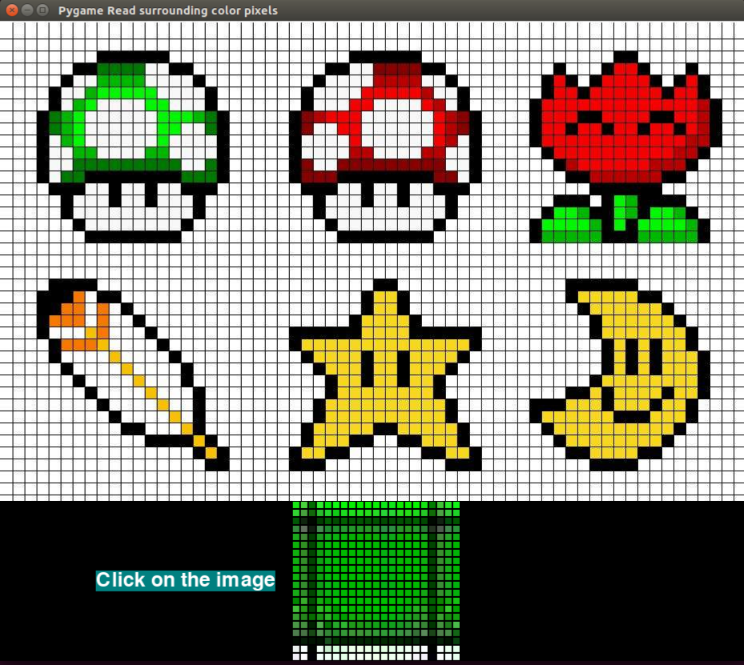

### Dojo2019 ZMS PygameColor
Vamos a aprender a programar con **Python**. 
Para ello, vamos a empezar a programar con una librería para crear nuestros propios videojuegos denominada **[Pygame](https://www.pygame.org)**. En el enlace de esta librería podemos encontrar mucha información y trucos para realizar nuestros propios programas y juegos, pero a veces puede resultar un poco más complicado de lo que parece si no vamos poco a poco. 

Primero vamos a especificar un **objetivo**, acto seguido plantearemos cómo vamos a llevarlo a cabo y finalmente desarrollaremos la información necesaria para cada prueba.

## Objetivo

El objetivo que queremos desarrollar es crear una serie de **algoritmos de tratamiento de imagen**.
Estos objetivos irán aumentando su complejidad a medida que avanzemos, por lo que es recomendable revisar la documentación de las lecciones previas.

1. Pixel by Pixel
	- Load Image in pygame
	- Read Color Pixels
	- Surrounding Color
	- Navigation
2. Line Colour Tracing
	- Drawing Shapes
	- Moore Neighbour Algorithm
3. Maze
	- Create your own labyrinth
4. Solve your maze

##Cómo llevarlo a cabo

Para crear nuestros programas sin necesidad de instalar nada, podemos acceder a la **siguiente [página web](https://repl.it/languages/python3)** y empezar a escribir en la zona del editor y pulsar el botón **Run** de la parte de arriba.

- [Python](https://repl.it/languages/python3) 

Para cada ejercicio, solamente hay que acceder al **código de prueba** que tenemos en este directorio.
Copiamos y pegamos su contenido y en los comentarios encontraremos la prueba que tenemos que seguir paso a paso.

En cada código de prueba hay comentarios que deberán aparecer en gris y estarán precedidos del símbolo de almohadilla **\#**.

Cuando tengamos que escribir nuestro propio código, la linea quedará precedida de dos almohadillas **\#\#**.

## Load Image in pygame
Dentro de nuestra escena de videojuegos podemos dibujar con formas simples nuestro entorno o cargar elementos mediante archivos de imagen. En este caso vamos

- Importar las librerías necesarias y crear las variables del programa.
- Iniciar el entorno de pygame definiendo el tamaño de nuestra ventana de videojuegos.
- Cargar una imagen desde un directorio contenido en nuestro proyecto. En nuestro caso, las imagenes estan almacenadas en una carpeta llamada **src**
- Definir un bucle de ejecución y terminar el programa al presionar una tecla de cierre registrando un evento de usuario.

Para importar las librerías necesarias, solamente tendremos que definir el nombre de pygame, precedido de la palabra **import**. A veces es útil cargar algunas extensiones de la librería. En este caso cargaremos algunas variables locales que nos ayudaran a definir el nombre de algunas teclas.
Con pygame.init() inicializaremos la carga del modulo y ya podremos empezar a crear nuestro programa con **Pygame**.

> import pygame
> from pygame.locals import * 
> pygame.init()
> pygame.display.set_caption('Pygame Load Image') 

Acto seguido, definiremos en una variables la escena de juego determinando en una lista, las dos coordenadas de ancho y alto que vamos a escoger para crear la ventana.

> size = [800, 500]
> screen = pygame.display.set_mode( size , pygame.RESIZABLE)

Si nos damos cuenta del segundo atributo, estamos haciendo que el ancho y alto de nuestra ventana sea variable definiendo **[pygame.RESIZABLE](https://www.pygame.org/wiki/WindowResizing)**.

Vamos a cargar nuestra imagen y queremos obtener el valor del tamaño para redimensionar la ventana de juego al tamaño de la imagen escogida.

> background_image = pygame.image.load("src/mariogrid.png").convert()
> size = background_image.get_rect().size
> screen = pygame.display.set_mode( size , pygame.RESIZABLE)

\* El metodo **convert()** hace que las imagenes con transparencia se mantengan y no oculten otras imágenes que puedan disponerse al fondo.

Aunque hayamos ejecutado todo lo anterior, no aparecerá ninguna imagen, ya que pygame ejecuta los gráficos manteniendolos en un bucle con el método **blit()**. Para ello, debemos crear un bucle infinito que finalice su acción cuando presionemos una tecla de evento.

Para ello, deberemos registrar el evento de la siguiente manera.

>while True: # main game loop 
>	screen.blit( background_image, [0,0] )
>	for event in pygame.event.get():
>		if event.type == QUIT  or (event.type == KEYDOWN and event.key == K_ESCAPE): 
>			pygame.quit() 
>			sys.exit()
>		
>	pygame.display.update()	

Durante esta sección solamente tendrás que tener en cuenta que el formato de este programa se debe mantener en el resto de programas y sobre el que trabajaremos el resto de códigos.

Una vez que sepamos qué significa cada linea, deberemos buscar e incluir nuestras propias imágenes a nuestro proyecto y cargarlas.

Para ello, vamos a buscar 3 formatos distintos de imagen.
- Una imagen de dibujo vectorial en el que no haya cambios de color entre las formas del dibujo.
- Una imagen de dibujo con defectos en el procesado de pixeles.
- Una imagen real con amplia gama de colores.

Para finalizar esta prueba y ya que sabemos como redimensionar imágenes, queremos hacer una zona inferior de **100 pixeles de alto** en la que poder visualizar algunos resultados para los siguiente ejercicios. La pantalla de nuestro dibujo deberá aparecer como en la siguiente imagen.

##Pixel by Pixel

Ahora mismo, vamos a aprender a leer pixel por pixel.
#Obtener información del raton

Para obtener información del ratón deberemos trasladarnos a nuestro bucle y capturar un evento adicional que será el click del ratón.

>for event in pygame.event.get():
>	if event.type == pygame.MOUSEBUTTONUP:
>		coords = pygame.mouse.get_pos()
>		print( coords )
>	if event.type == QUIT  or (event.type == KEYDOWN and event.key == K_ESCAPE): 
>		pygame.quit() 
>		sys.exit()

#Read Pixels
Para obtener el color de cada pixel sobre el que presionamos deberemos ejecutar la siguiente función introduciendo las coordenadas sobre las que hemos presionado el ratón.

>color = screen.get_at( coords )
>print (color)

El [color](https://www.pygame.org/docs/ref/color.html) se representa como cuatro numeros que indican los valores ( r, g, b, alpha ) -> Rojo, Verde, Azul y Transparencia.

Con la función de cada superficie como puede ser nuestra imagen o [screen.get_at( x, y )](https://www.pygame.org/docs/ref/surface.html#pygame.Surface.get_at) podemos obtener el color de nuestro pixel.

Nuestro objetivo es crear un cuadrado de **100 pixeles de ancho y 100 de alto** en la parte inferior de nuestra imagen y situada en el centro respecto de su ancho para visualizar el color que hemos seleccionado.

Para ello usaremos dos funciones. La primera define el origen de la esquina superior izquierda ( x, y ) y la anchura y altura del rectangulo ( w, h ). Para buscar mas documentación se puede acceder al siguiente [enlace](https://www.pygame.org/docs/ref/rect.html).
Una vez creado lo podemos dibujar en la pantalla con [pygame.draw.rect()](https://www.pygame.org/docs/ref/draw.html#pygame.draw.rect)

>rectangle  = pygame.Rect( x, y, w, h)
>pygame.draw.rect( screen, color , rectangle )

Para conocer la posicion y dimensiones, recomendamos hacerse un dibujo en papel crear una variable para el tamaño del cuadrado para operar matematicamente entre las distintas componentes.

## Surrounding Color

En esta prueba, vamos a crear una matriz de 3 filas y 3 columnas para visualizar los colores que tenemos alrededor de un pixel seleccionado.

Para ello, vamos a tener que realizar algunas operaciones matemáticas y aplicar el concepto de bucle correctamente para cumplir con nuestro objetivo.

>for x in range(-1,2):
>	for y in range(-1,2):
> 		color = screen.get_at( ( position[0] +x, position[1] +y) )
>		print( ' Px: ', x , ' Py: ', y ,' Color: ',color)

Este bucle se desplaza desde el valor -1 a 0 y a 1, de esta manera podemos acceder al entorno de un pixel con este bucle.

Cuando tengamos el valor del color de cada cuadrado en nuestra malla, tendremos que representarlo en nuestra zona de visualización.

## Navigation 
Una vez llegados a este punto, queremos actualizar los píxeles que podemos ver alrededor cuando presionamos con el raton y desplazarnos con las flechas. De esta manera podremos visualizar como cambian los pixeles a medida que nos desplazamos y 

Para este ejercicio podemos copiar el ejemplo que tenemos publicado y observar estas variaciones de color en función de la imagen que hemos escogido. Como veremos, las zonas que aparentemente son del mismo color no tienen los mismos valores y existen ligeras variaciones. Es por ello, que deberemos escoger bien nuestras imagenes de muestra si queremos acceder a el siguiente nivel exitosamente.

